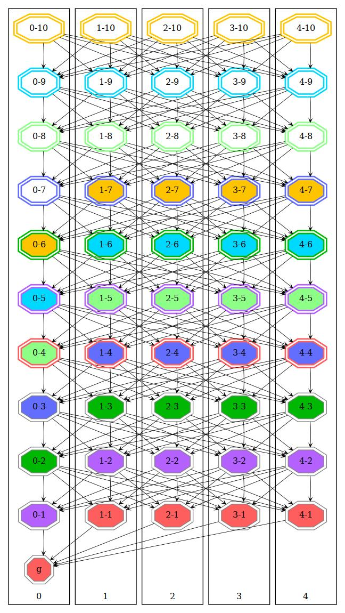
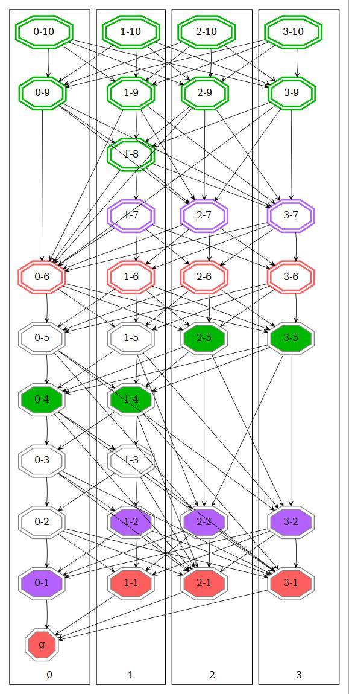
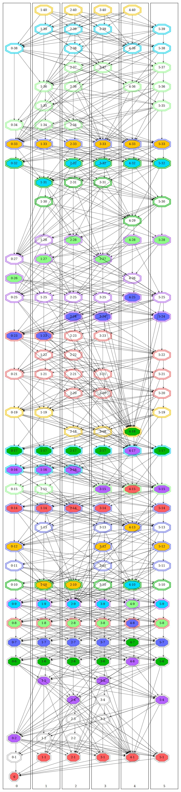
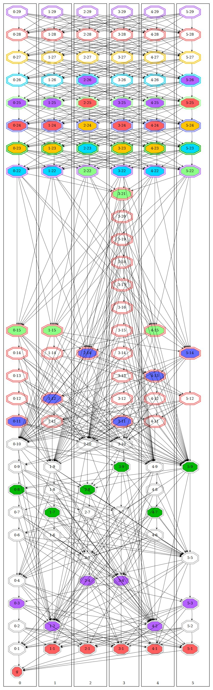

# RChain dev finalization

[](https://github.com/tgrospic/rchain-dev-finalization/actions/workflows/ci.yml)

## Usage

### sbt console
```sh
# Enter sbt console 
sbt

# Compile
sbt> compile

# Compile with tests
sbt> Test/compile

# Run tests
sbt> test
```

### sbt CLI
```sh
# Compile
sbt compile

# Compile with tests
sbt "Test/compile"

# Run tests
sbt test
```

## Examples of generated DAGs in tests 

### All validators propose blocks in parallel

This is ideal situation where all validators are in perfect sync. In every _round_ they see each other previous blocks.



### Simple 2-partition branching and merging 

Validators `0` and `1` propose a few blocks without `2` and `3` and on height `5` they see each other.



### _Lazy_ validators and impact on finalization

This example simulates heavy loaded network with validators spending unequal time to propose blocks. Finalization fringe (next layer) can contain more then one block from faster validators. 



### Sparse DAG with more difficult finalization

Simulation of even more heavy loaded network in which case multiple fringes can be finalized at once.


